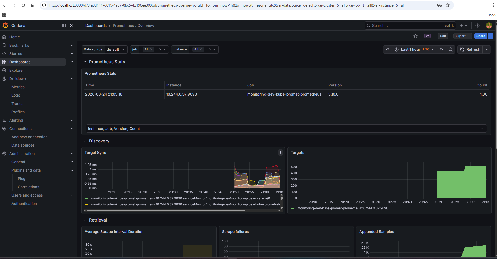
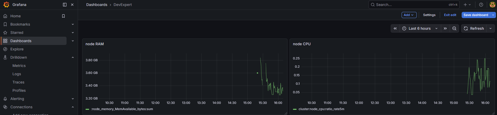
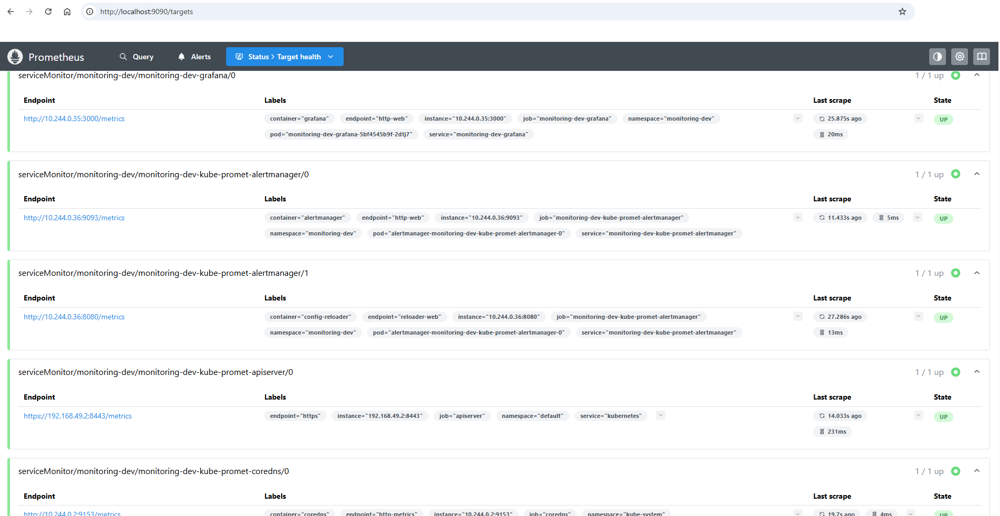
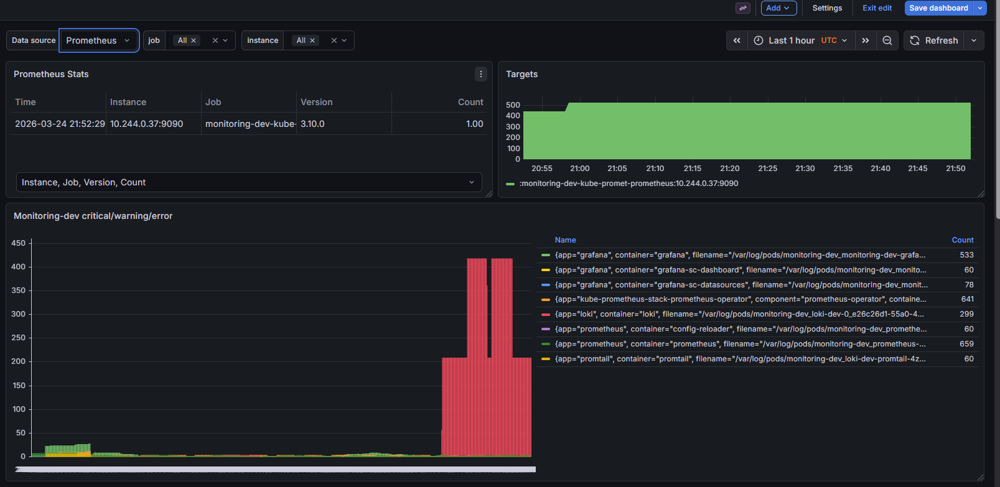
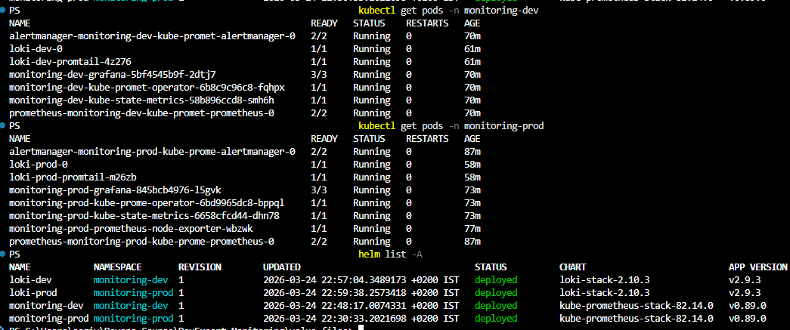
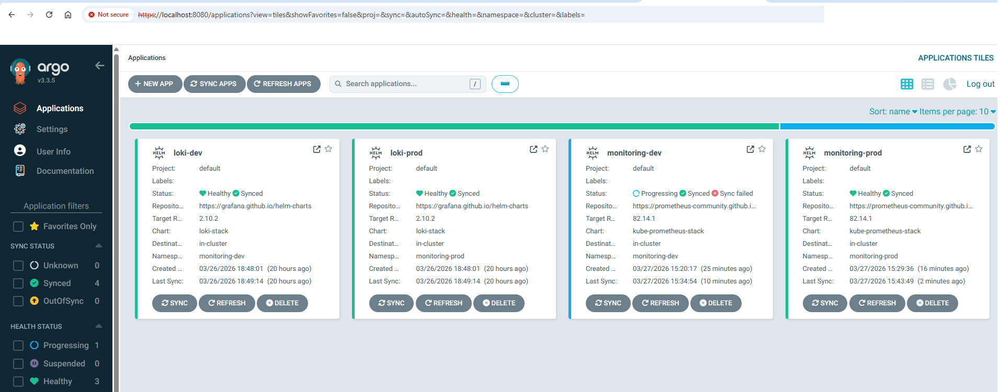

  
  

<h1 align="center">Kubernetes Observability Lab</h1>

  Monitoring, logging and alerting on Minikube using Prometheus, Grafana, Alertmanager, Loki, Promtail and ArgoCD

---

## Overview

This project implements a Kubernetes observability stack on Minikube for two environments: **dev** and **prod**.

The deployment includes:

- Prometheus
- Grafana
- Alertmanager
- Loki
- Promtail

In addition, ArgoCD was used as part of the bonus GitOps section.

The environments were separated using dedicated namespaces and separate Helm values files.

---

## Deliverables

This repository includes:

- `values-dev.yaml`
- `values-prod.yaml`
- `loki-values-dev.yaml`
- `loki-values-prod.yaml`
- Screenshots of dashboards, logs and deployment status
- A short explanation of the deployment flow
- A short explanation of:
  - Why `helm upgrade --install` is used
  - How alerts are configured
  - The differences between dev and prod

---

## Step 1 — Prepare the Environment

Minikube and Helm were prepared, and separate namespaces were created for each environment:

    kubectl create namespace monitoring-dev
    kubectl create namespace monitoring-prod

This separation allows deploying the same architecture in both environments while keeping different configurations.

---

## Step 2 — Add Helm Repositories

The following Helm repositories were added:

    helm repo add prometheus-community https://prometheus-community.github.io/helm-charts
    helm repo add grafana https://grafana.github.io/helm-charts
    helm repo update

These repositories were used for both the monitoring and logging stack deployments.

---

## Step 3 — Prepare Values Files

The project uses four values files:

- `values-dev.yaml`
- `values-prod.yaml`
- `loki-values-dev.yaml`
- `loki-values-prod.yaml`

### Dev configuration

- Namespace: `monitoring-dev`
- Grafana admin password: `devadmin`
- Service type: `ClusterIP`
- Prometheus retention: `7d`
- Loki persistence: disabled

### Prod configuration

- Namespace: `monitoring-prod`
- Grafana admin password: `prodadmin`
- Service type: `ClusterIP`
- Prometheus retention: `30d`
- Loki persistence: enabled
- Loki PVC size: `10Gi`

This keeps the architecture the same across environments while applying different operational settings.

---

## Step 4 — Deploy Prometheus, Grafana and Alertmanager

The monitoring stack was deployed using:

    helm upgrade --install monitoring-dev prometheus-community/kube-prometheus-stack -n monitoring-dev -f values-dev.yaml
    helm upgrade --install monitoring-prod prometheus-community/kube-prometheus-stack -n monitoring-prod -f values-prod.yaml

### Why `helm upgrade --install` is used

`helm upgrade --install` is used because it supports both installation and upgrade in a single command.

Benefits:

- If the release does not exist, Helm installs it
- If the release already exists, Helm upgrades it
- It avoids failures when re-running deployment commands
- It supports idempotent deployment
- It is useful during repeated testing and troubleshooting

---

## Step 5 — Deploy Loki and Promtail

The logging stack was deployed using:

    helm upgrade --install loki-dev grafana/loki-stack -n monitoring-dev -f loki-values-dev.yaml
    helm upgrade --install loki-prod grafana/loki-stack -n monitoring-prod -f loki-values-prod.yaml

This deployment provides centralized logging for Kubernetes workloads.

It allows:

- Collecting pod logs
- Sending logs to Loki
- Querying logs from Grafana

---

## Step 6 — Access the Dashboards

The services were accessed using `kubectl port-forward`.

### Grafana

    kubectl port-forward svc/monitoring-dev-grafana -n monitoring-dev 3000:80

Login details:

- Username: `admin`
- Password: `devadmin`

### Prometheus

    kubectl port-forward svc/monitoring-dev-kube-prometheus-prometheus -n monitoring-dev 9090:9090

### Loki

    kubectl port-forward svc/loki -n monitoring-dev 3100:3100

If service names differ, they can be checked with:

    kubectl get svc -n monitoring-dev
    kubectl get svc -n monitoring-prod

---

## Step 7 — Explore Dashboards and Logs

After deployment, the environment was validated through Grafana, Prometheus and Loki.

### Validation performed

1. Accessed Grafana
2. Viewed the built-in cluster and node dashboards
3. Created a simple dashboard for node CPU and RAM usage
4. Confirmed Prometheus targets were up
5. Queried logs from Loki inside Grafana Explore

### Screenshots

#### Grafana Dashboard

#### Node CPU and RAM Dashboard

#### Prometheus Targets

#### Loki Logs

#### Final Deployment Status

---

## Step 8 — Alerts

A custom alert rule was added in the values configuration, and Alertmanager is deployed as part of the `kube-prometheus-stack`.

### How alerts are configured

Alerts are configured through Prometheus alerting rules and handled by Alertmanager.

The general flow is:

1. Prometheus evaluates the alert rule
2. When the condition becomes true, an alert is triggered
3. The alert is sent to Alertmanager
4. Alertmanager can group, route or silence the alert

### Status in this project

- Alertmanager is deployed as part of the monitoring stack
- A custom alert rule was added in the values file
- This demonstrates how alerting can be configured through the Helm values file

---

## Step 9 — Dev / Prod Parity

The project demonstrates dev/prod parity using the same charts and deployment method, with different values files per environment.

### Dev

- Namespace: `monitoring-dev`
- Grafana password: `devadmin`
- Prometheus retention: `7d`
- Loki persistence: disabled

### Prod

- Namespace: `monitoring-prod`
- Grafana password: `prodadmin`
- Prometheus retention: `30d`
- Loki persistence: enabled
- Loki storage: `10Gi`

This approach keeps the platform consistent while allowing each environment to have different persistence and retention settings.

---

## Step 10 — GitOps Bonus with ArgoCD

As part of the bonus section, ArgoCD was used to manage the applications in a GitOps workflow.

ArgoCD provides:

- Declarative application management from Git
- Sync status visibility
- Health monitoring for the deployed applications
- Centralized management for monitoring and logging applications

### ArgoCD Dashboard

---

## Project Structure

    .
    ├── values-dev.yaml
    ├── values-prod.yaml
    ├── loki-values-dev.yaml
    ├── loki-values-prod.yaml
    ├── screenshots/
    │   ├── grafana-dashboard-dev.png
    │   ├── node-cpu-ram.png
    │   ├── prometheus-targets-dev.png
    │   ├── loki-dashboard-dev.png
    │   ├── final-status.png
    │   └── agro-dash.png
    └── README.md

---

## Summary

This project successfully deploys an observability platform on Minikube with:

- Prometheus for metrics collection
- Grafana for dashboards
- Alertmanager for alert handling
- Loki and Promtail for centralized logging
- ArgoCD for GitOps-based application management

The repository includes the required values files, screenshots, and a short explanation of the implementation according to the assignment steps.